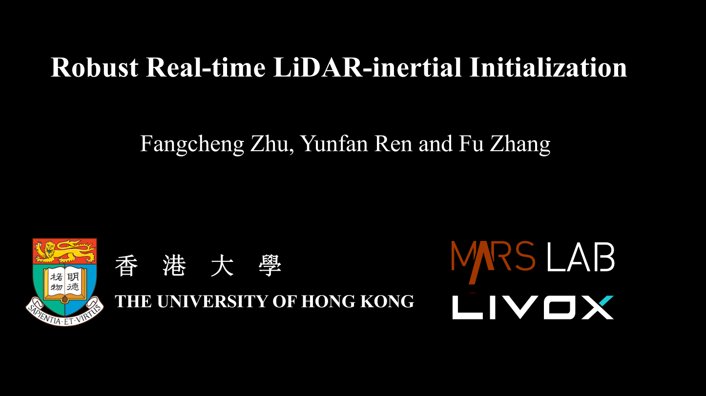
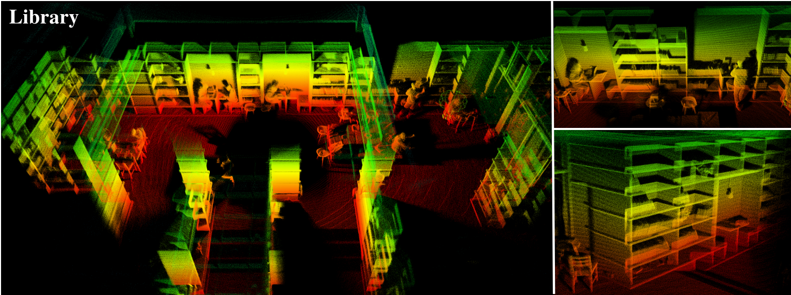
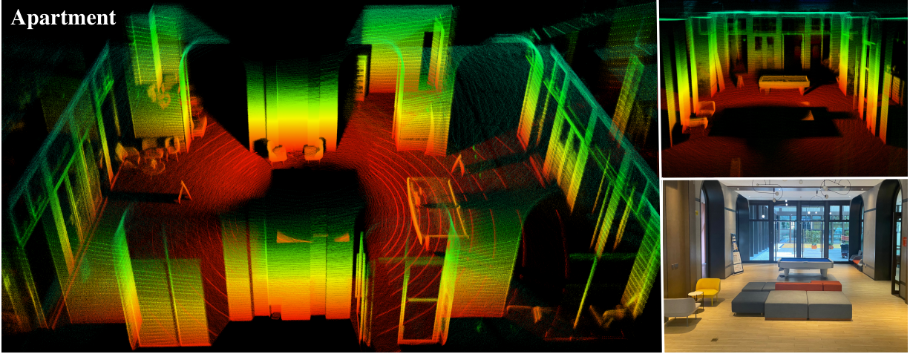

## Robust Real-time LiDAR-inertial Initialization (ROS2 Version)

This is ros2 version **LI_Init** project, your can find the orignal repository at [LI_Init](https://github.com/hku-mars/LiDAR_IMU_Init)

**LI-Init** is a robust, real-time initialization method for LiDAR-inertial system. The proposed method calibrates the temporal offset and extrinsic parameter between LiDARs and IMUs, and also the gravity vector and IMU bias. Our method does not require any target or extra sensor, specific structured environment, prior environment point map or initial values of extrinsic and time offset. Our package address following key issues:

1. A robust LiDAR odometry (**FAST-LO**) modified from FAST-LIO2.
2. Fast and robust **temporal offset and extrinsic parameter calibration** between LiDAR and IMU without any hardware setup.
3. Support **multiple LiDAR types**: both mechanical spinning LiDAR (Hesai, Velodyne, Ouster) and solid-state LiDAR ( Livox Avia/Mid360)
4. Seamlessly merged into FAST-LIO2, as a robust initialization module.

**Orignal Contributors**: [Fangcheng Zhu 朱方程](https://github.com/zfc-zfc)， [Yunfan Ren 任云帆](https://github.com/RENyunfan)， [Wei Xu 徐威](https://github.com/XW-HKU)， [Yixi Cai 蔡逸熙](https://github.com/Ecstasy-EC)

### Pipeline

<div align="center"></div>

### Excite the Sensors

<div align="center"></div>

### Related Paper

related papers are now available:  [Robust Real-time LiDAR-inertial Initialization](https://ieeexplore.ieee.org/document/9982225)

If this project is used in your work, please cite the following paper:
```
@inproceedings{zhu2022robust,
  title={Robust real-time lidar-inertial initialization},
  author={Zhu, Fangcheng and Ren, Yunfan and Zhang, Fu},
  booktitle={2022 IEEE/RSJ International Conference on Intelligent Robots and Systems (IROS)},
  pages={3948--3955},
  year={2022},
  organization={IEEE}
}
```

### Related Video:

orignal accompanying videos are now available on **YouTube** (click below images to open) and [Bilibili](https://www.bilibili.com/video/BV1ZS4y127mW?spm_id_from=333.337.search-card.all.click).

<div align="center">
    <a href="https://www.youtube.com/watch?v=WiHgcPpKwvU" target="_blank">
    
</div>


## 1. Prerequisites

### 1.1 **Ubuntu** and **ROS2**

Ubuntu >=20.04.

ROS >= Foxy. 

### 1.2. **PCL && Eigen**

```
sudo apt install libpcl-dev libeigen3-dev
```

### 1.3. **livox_ros_driver2 & livox sdk**

These two projects has been added as submodule of this repository, you can sync them with following command after clone this repository.
```
git submodle update --init
```
###  **1.4. ceres-solver & OpenMP**
```
sudo apt install libceres-dev libomp-dev
```

### **1.5. Getting start with Docker**  

This project has been tested inside docker container with official ros:foxy image.
```
    docker pull ros:foxy
```
Don't forget to install additional dependencies list above.

## 2. Build

- Clone the repository:
   ```
    git clone https://github.com/cheny110/calib_ws -b master
   ```
- Sync submodules :
    ```
    cd calib_ws
    git submodule update --init
   ```
- build and install livox sdk if you used livox lidars (optional)
```
cd calib_ws/dependencies/Livox-SDK2
mkdir build && cd build
cmake .. 
make -j
sudo make install
```
- build interfaces
    ```
    cd calib_ws
    colcon build --packages-select lidar_imu_interfaces  livox_ros_driver2
    ```
- build package of LI_init package
  ```
    source calib_ws/install/setup.sh
    colcon build --packages-select lidar_imu_init2
  ```

## 3. Run Your Own Data

**Please make sure the unit of your input angular velocity is rad/s.** If it is degree/s, please refer to https://github.com/hku-mars/LiDAR_IMU_Init/issues/43.

**Please make sure the parameters in config/xxx.yaml are correct before running the project.**

**It is highly recommended to stay still for more than 5 seconds after launch the algorithm, for accumulating dense initial map.**

It is highly recommended to run LI-Init and record your own data simultaneously, because our algorithm is able to automatically detect the degree of excitation and instruct users how to give sufficient excitation (e.g. rotate or move along which direction).

Theoretically livox_avia.launch supports mid-70, mid-40 LiDARs.

**Note:** The code of LI-Init contains the initialization module and sequential FAST-LIO. If you run the code of LI-Init, it will first do initialization (if suffienct excitation is given, it will tell you the extrinsic transformation and temporal offset) and then it will switch into FAST-LIO. **Thus, if you want to run FAST-LIO on your own data but unfortunately the LiDAR and IMU are not synchronized or calibrated before, you can directly run LI-Init**. As for R3LIVE, you can write the extrinsic and temporal offset between LiDAR and IMU obtained by LI-Init into the config file of R3LIVE.

### Important parameters

Edit `config/xxx.yaml` to set the below parameters:

* `lid_topic`:  Topic name of LiDAR pointcloud.
* `imu_topic`:  Topic name of IMU measurements.

* `cut_frame_num`: Split one frame into sub-frames, to improve the odom frequency. Must be positive integers.
* `orig_odom_freq` (Hz): Original LiDAR input frequency. For most LiDARs, the input frequency is 10 Hz. It is recommended that cut_frame_num * orig_odom_freq = 30 for mechinical spinning LiDAR,  cut_frame_num * orig_odom_freq = 50 for livox LiDARs.
* `mean_acc_norm` (m/s^2):  The acceleration norm when IMU is stationary. Usually, 9.805 for normal IMU, 1 for livox built-in IMU.
* `data_accum_length`: A threshold to assess if the data is enough for initialization. Too small may lead to bad-quality results.
* `online_refine_time` (second):  The time of extrinsic refinement with FAST-LIO2. About 15~30 seconds of refinement is recommended.
* `filter_size_surf` (meter):  It is recommended that filter_size_surf = 0.05~0.15 for indoor scenes, filter_size_surf = 0.5 for outdoor scenes.
* `filter_size_map` (meter): It is recommended that filter_size_map = 0.15~0.25 for indoor scenes, filter_size_map = 0.5 for outdoor scenes.


After setting the correct topic name and parameters, you can directly run **LI-Init** with your own data..

```
cd catkin_ws
source devel/setup.bash
roslaunch lidar_imu_init xxx.launch
```

After initialization and refinement finished, the result would be written into `catkin_ws/src/LiDAR_IMU_Init/result/Initialization_result.txt`

## 4. Rosbag Example

Download our test bags here: [Lidar IMU Initialization Datasets](https://connecthkuhk-my.sharepoint.com/:f:/g/personal/zhufc_connect_hku_hk/EgdJ_F763sVOnkUNBRv-op8BmNL7eZrxETu2zSEAoiRX4A?e=cbNiJI).

Use `rosbag info xxx.bag` to get the correct topic name.

**Please note**: if the tested IMU is Livox built-in IMU, *mean_acc_norm* should be 1. If the IMU is Pixhawk IMU, *mean_acc_norm* should be 9.805.

Here are the pointcloud map constructed by our LiDAR odometry (FAST-LO).

<div align="center"></div>

<div align="center"></div>

## 5. Acknowledgments

Thanks for [HKU MaRS Lab](https://github.com/hku-mars),  [Fast-LIO2](https://github.com/hku-mars/FAST_LIO) (Fast Direct LiDAR-inertial Odometry) and [ikd-tree](https://github.com/hku-mars/ikd-Tree).

Thanks for [Livox Technology](https://www.livoxtech.com/) for equipment support.


## 6. Run FAST-LIO2 with LI-Init Results

The most important parameters for FAST-LIO are the **extrinsic rotation and translation matrix**, and the **time offset**. 

For the same device setup (the relative pose between IMU and LiDAR is fixed), **you can just write the extrinsic into FAST-LIO's configuration file**.

As for time offset, it depends on the synchronization mechanism of the lidar and IMU. For pixhawk IMU, as far as I know, the timestamp is PC time. If the lidar's timestamp is also PC time, then the time offset might be the same. You can bypass temporal initialization next time. But for some lidars like Livox avia/horizon, the timestamp origin is the moment when the lidar is powered on. So, if you power it off and power it on again, the timestamp counts from 0. In this condition, temporal initialization is necessary at each time the lidar is powered on. So, you can run LI-Init once, record the time offset; then power off the lidar and IMU for minutes, then power on them and calibrate time offset again. **If the time offset are close,** it means you may **bypass time offset initialization** next time. Just **write down the time offset into time_diff_lidar_to_imu** of FAST-LIO's configuration file.

As for IMU bias and gravity, FAST-LIO can refine them online. You don't need to write these prameters.

## 7. License

The source code is released under [GPLv2](http://www.gnu.org/licenses/) license.

We are still working on improving the performance and reliability of our codes. For any technical issues, please contact us via email [zhufc@connect.hku.hk](mailto:zhufc@connect.hku.hk). For commercial use, please contact Dr. Fu Zhang [fuzhang@hku.hk](mailto:fuzhang@hku.hk).